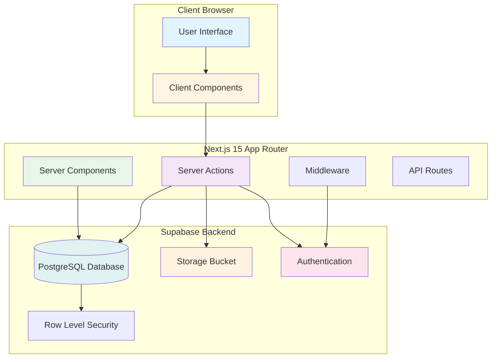
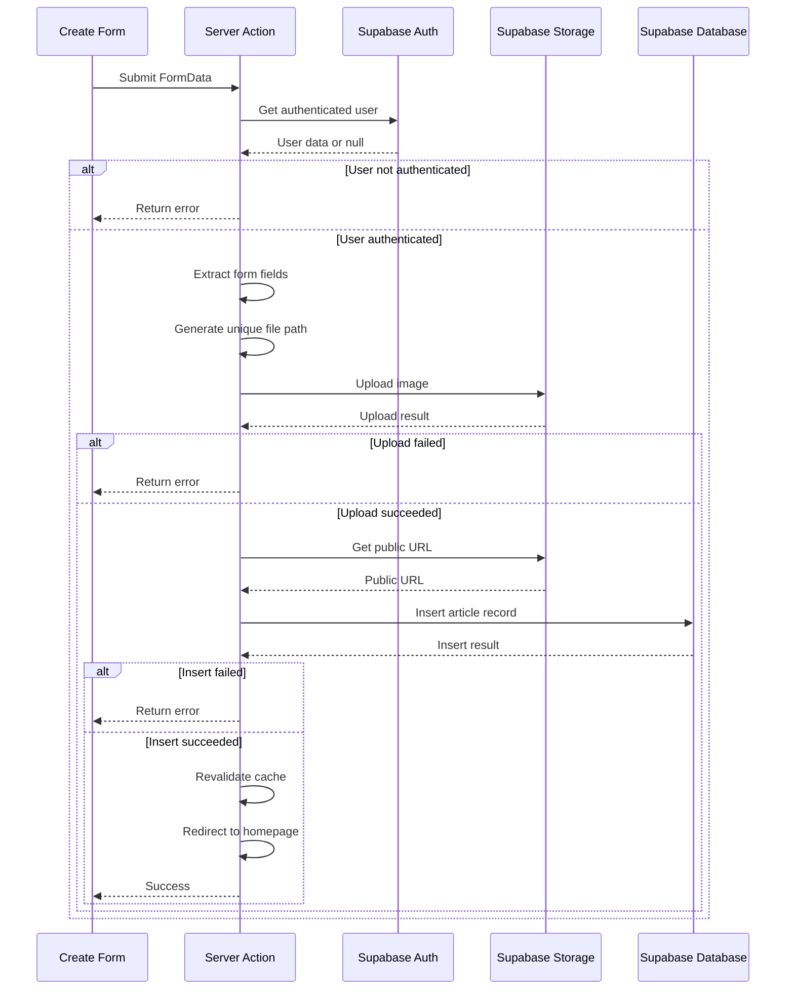

# Design Document

## Overview

The Article Creation Tool is a full-stack Next.js 15 application that enables authenticated users to create articles with rich content and cover images. The system uses Supabase as the backend-as-a-service platform, providing database storage, file storage, and authentication services. The architecture follows Next.js 15 App Router conventions with Server Components for data fetching and Client Components for interactive forms. using pnpm.

## Architecture

### High-Level Architecture



### Technology Stack

- **Frontend Framework**: Next.js 15.5.4 with App Router
- **Language**: TypeScript 5
- **UI Library**: React 19.1.0
- **Styling**: Tailwind CSS 4
- **Backend**: Supabase (PostgreSQL, Storage, Auth)
- **Supabase Client**: @supabase/ssr (to be added)
- **Image Optimization**: Next.js Image component

## Components and Interfaces

### 1. Supabase Backend Configuration

#### Database Schema

**Articles Table**
```sql
CREATE TABLE articles (
  id UUID PRIMARY KEY DEFAULT gen_random_uuid(),
  created_at TIMESTAMPTZ DEFAULT NOW(),
  title TEXT NOT NULL,
  content TEXT NOT NULL,
  image_url TEXT NOT NULL,
  user_id UUID NOT NULL REFERENCES auth.users(id) ON DELETE CASCADE
);

-- Create index for faster queries
CREATE INDEX idx_articles_user_id ON articles(user_id);
CREATE INDEX idx_articles_created_at ON articles(created_at DESC);
```

**Row Level Security Policies**
```sql
-- Enable RLS
ALTER TABLE articles ENABLE ROW LEVEL SECURITY;

-- Policy 1: Allow public read access
CREATE POLICY "Allow public read access"
ON articles FOR SELECT
TO public
USING (true);

-- Policy 2: Allow authenticated users to insert
CREATE POLICY "Allow authenticated insert"
ON articles FOR INSERT
TO authenticated
WITH CHECK (auth.uid() = user_id);

-- Policy 3: Allow users to update their own articles
CREATE POLICY "Allow users to update own articles"
ON articles FOR UPDATE
TO authenticated
USING (auth.uid() = user_id)
WITH CHECK (auth.uid() = user_id);

-- Policy 4: Allow users to delete their own articles
CREATE POLICY "Allow users to delete own articles"
ON articles FOR DELETE
TO authenticated
USING (auth.uid() = user_id);
```

#### Storage Bucket Configuration

**Bucket Name**: `article_images`

**Bucket Settings**:
- Public: Yes (for read access)
- File size limit: 5MB (recommended)
- Allowed MIME types: image/jpeg, image/png, image/webp, image/gif

**Storage Policies**:
```sql
-- Allow public read access to images
CREATE POLICY "Public read access"
ON storage.objects FOR SELECT
TO public
USING (bucket_id = 'article_images');

-- Allow authenticated users to upload
CREATE POLICY "Authenticated users can upload"
ON storage.objects FOR INSERT
TO authenticated
WITH CHECK (
  bucket_id = 'article_images' AND
  (storage.foldername(name))[1] = auth.uid()::text
);

-- Allow users to update their own images
CREATE POLICY "Users can update own images"
ON storage.objects FOR UPDATE
TO authenticated
USING (
  bucket_id = 'article_images' AND
  (storage.foldername(name))[1] = auth.uid()::text
);

-- Allow users to delete their own images
CREATE POLICY "Users can delete own images"
ON storage.objects FOR DELETE
TO authenticated
USING (
  bucket_id = 'article_images' AND
  (storage.foldername(name))[1] = auth.uid()::text
);
```

### 2. Supabase Client Configuration

#### Environment Variables

```env
# Supabase Configuration
NEXT_PUBLIC_SUPABASE_URL=https://your-project.supabase.co
NEXT_PUBLIC_SUPABASE_ANON_KEY=your-anon-key
```

#### Client-Side Supabase Client

**File**: `src/lib/supabase/client.ts`

```typescript
import { createBrowserClient } from '@supabase/ssr'

export function createClient() {
  return createBrowserClient(
    process.env.NEXT_PUBLIC_SUPABASE_URL!,
    process.env.NEXT_PUBLIC_SUPABASE_ANON_KEY!
  )
}
```

**Purpose**: Used in Client Components for client-side operations like real-time subscriptions or client-side auth state management.

#### Server-Side Supabase Client

**File**: `src/lib/supabase/server.ts`

```typescript
import { createServerClient } from '@supabase/ssr'
import { cookies } from 'next/headers'

export async function createClient() {
  const cookieStore = await cookies()

  return createServerClient(
    process.env.NEXT_PUBLIC_SUPABASE_URL!,
    process.env.NEXT_PUBLIC_SUPABASE_ANON_KEY!,
    {
      cookies: {
        getAll() {
          return cookieStore.getAll()
        },
        setAll(cookiesToSet) {
          try {
            cookiesToSet.forEach(({ name, value, options }) =>
              cookieStore.set(name, value, options)
            )
          } catch {
            // The `setAll` method was called from a Server Component.
            // This can be ignored if you have middleware refreshing
            // user sessions.
          }
        },
      },
    }
  )
}
```

**Purpose**: Used in Server Components, Server Actions, and API Routes for server-side operations with proper cookie handling.

#### Authentication Middleware

**File**: `middleware.ts` (root level)

```typescript
import { createServerClient } from '@supabase/ssr'
import { NextResponse, type NextRequest } from 'next/server'

export async function middleware(request: NextRequest) {
  let supabaseResponse = NextResponse.next({
    request,
  })

  const supabase = createServerClient(
    process.env.NEXT_PUBLIC_SUPABASE_URL!,
    process.env.NEXT_PUBLIC_SUPABASE_ANON_KEY!,
    {
      cookies: {
        getAll() {
          return request.cookies.getAll()
        },
        setAll(cookiesToSet) {
          cookiesToSet.forEach(({ name, value, options }) => request.cookies.set(name, value))
          supabaseResponse = NextResponse.next({
            request,
          })
          cookiesToSet.forEach(({ name, value, options }) =>
            supabaseResponse.cookies.set(name, value, options)
          )
        },
      },
    }
  )

  // Refresh session if expired
  const {
    data: { user },
  } = await supabase.auth.getUser()

  // Protect /create-article route
  if (!user && request.nextUrl.pathname.startsWith('/create-article')) {
    const redirectUrl = request.nextUrl.clone()
    redirectUrl.pathname = '/login'
    redirectUrl.searchParams.set('redirectTo', request.nextUrl.pathname)
    return NextResponse.redirect(redirectUrl)
  }

  return supabaseResponse
}

export const config = {
  matcher: [
    '/((?!_next/static|_next/image|favicon.ico|.*\\.(?:svg|png|jpg|jpeg|gif|webp)$).*)',
  ],
}
```

**Purpose**: Manages authentication sessions across requests and protects routes that require authentication.

### 3. Article Creation Form (Client Component)

**File**: `src/app/create-article/page.tsx`

**Component Structure**:
```typescript
'use client'

interface FormState {
  error?: string
  success?: boolean
}

export default function CreateArticlePage() {
  // State management
  const [formState, setFormState] = useState<FormState>({})
  const [isPending, setIsPending] = useState(false)
  
  // Form submission handler
  async function handleSubmit(formData: FormData) {
    setIsPending(true)
    const result = await createArticle(formData)
    setIsPending(false)
    
    if (result.error) {
      setFormState({ error: result.error })
    }
  }
  
  return (
    <form action={handleSubmit}>
      {/* Title input */}
      <input type="text" name="title" required />
      
      {/* Content textarea */}
      <textarea name="content" required />
      
      {/* Image upload */}
      <input type="file" name="image" accept="image/*" required />
      
      {/* Submit button with loading state */}
      <button type="submit" disabled={isPending}>
        {isPending ? 'Creating...' : 'Create Article'}
      </button>
      
      {/* Error display */}
      {formState.error && <p>{formState.error}</p>}
    </form>
  )
}
```

**Key Features**:
- Client Component for interactivity
- Form validation (required fields)
- Loading state during submission
- Error message display
- File input with image type restriction

### 4. Server Action for Article Creation

**File**: `src/app/actions.ts`

**Function Signature**:
```typescript
export async function createArticle(formData: FormData): Promise<{
  error?: string
  success?: boolean
}>
```

**Processing Flow**:


**Implementation Details**:

1. **Authentication Check**:
   - Get current user from Supabase
   - Return error if not authenticated

2. **Form Data Extraction**:
   - Extract title (string)
   - Extract content (string)
   - Extract image (File object)

3. **Image Upload**:
   - Generate unique path: `${user.id}/${Date.now()}-${filename}`
   - Upload to `article_images` bucket
   - Handle upload errors

4. **Get Public URL**:
   - Retrieve public URL for uploaded image
   - Store URL for database insertion

5. **Database Insertion**:
   - Insert article with title, content, image_url, user_id
   - Handle database errors

6. **Cache Revalidation**:
   - Call `revalidatePath('/')` to update homepage
   - Redirect to homepage using `redirect('/')`

### 5. Article Display (Server Component)

**File**: `src/app/page.tsx`

**Component Structure**:
```typescript
import { createClient } from '@/lib/supabase/server'
import Image from 'next/image'

export default async function HomePage() {
  const supabase = await createClient()
  
  // Fetch articles
  const { data: articles, error } = await supabase
    .from('articles')
    .select('*')
    .order('created_at', { ascending: false })
  
  if (error) {
    console.error('Error fetching articles:', error)
    return <div>Error loading articles</div>
  }
  
  return (
    <div>
      <h1>Articles</h1>
      <div>
        {articles?.map((article) => (
          <article key={article.id}>
            <h2>{article.title}</h2>
            <Image
              src={article.image_url}
              alt={article.title}
              width={800}
              height={400}
              priority={false}
            />
            <p>{article.content.substring(0, 200)}...</p>
          </article>
        ))}
      </div>
    </div>
  )
}
```

**Key Features**:
- Server Component for optimal performance
- Fetches all articles from database
- Orders by creation date (newest first)
- Uses Next.js Image component for optimization
- Error handling for failed queries

## Data Models

### Article Type

```typescript
interface Article {
  id: string
  created_at: string
  title: string
  content: string
  image_url: string
  user_id: string
}
```

### Form Data Structure

```typescript
interface ArticleFormData {
  title: string
  content: string
  image: File
}
```

### Server Action Response

```typescript
interface ActionResponse {
  error?: string
  success?: boolean
}
```

## Error Handling

### Error Categories

1. **Authentication Errors**
   - User not authenticated
   - Session expired
   - Invalid credentials

2. **Validation Errors**
   - Missing required fields
   - Invalid file type
   - File size exceeds limit

3. **Upload Errors**
   - Storage bucket not accessible
   - Network failure during upload
   - Insufficient permissions

4. **Database Errors**
   - Connection failure
   - Constraint violation
   - RLS policy rejection

### Error Handling Strategy

**Client-Side**:
- Display user-friendly error messages
- Maintain form state on error
- Provide retry mechanism

**Server-Side**:
- Log detailed errors for debugging
- Return sanitized error messages to client
- Implement proper error boundaries

**Example Error Handling**:
```typescript
try {
  // Upload image
  const { data, error } = await supabase.storage
    .from('article_images')
    .upload(filePath, imageFile)
  
  if (error) {
    console.error('Upload error:', error)
    return { error: 'Failed to upload image. Please try again.' }
  }
} catch (err) {
  console.error('Unexpected error:', err)
  return { error: 'An unexpected error occurred. Please try again.' }
}
```

## Testing Strategy

### Unit Tests

1. **Supabase Client Creation**
   - Test client initialization
   - Verify environment variables are loaded
   - Test cookie handling

2. **Form Validation**
   - Test required field validation
   - Test file type validation
   - Test file size validation

3. **Server Action Logic**
   - Test authentication check
   - Test form data extraction
   - Test file path generation

### Integration Tests

1. **Article Creation Flow**
   - Test complete article creation process
   - Verify image upload to storage
   - Verify database record creation
   - Test cache revalidation

2. **Article Display**
   - Test article fetching
   - Verify correct ordering
   - Test error handling

3. **Authentication Flow**
   - Test protected route access
   - Test middleware redirect
   - Test session management

### End-to-End Tests

1. **User Journey**
   - User logs in
   - User navigates to create article page
   - User fills form and uploads image
   - User submits form
   - User sees new article on homepage

2. **Error Scenarios**
   - Test unauthenticated access
   - Test invalid file upload
   - Test network failures

## Security Considerations

1. **Row Level Security**
   - All database access controlled by RLS policies
   - Users can only modify their own articles
   - Public read access for all articles

2. **File Upload Security**
   - File type validation on client and server
   - File size limits enforced
   - Unique file paths prevent collisions
   - User-scoped storage paths

3. **Authentication**
   - Middleware protects sensitive routes
   - Server-side authentication checks
   - Secure cookie handling

4. **Data Validation**
   - Server-side validation of all inputs
   - SQL injection prevention via Supabase client
   - XSS prevention via React's built-in escaping

## Performance Optimization

1. **Image Optimization**
   - Next.js Image component for automatic optimization
   - Lazy loading for images below the fold
   - Responsive images with srcset

2. **Server Components**
   - Reduced JavaScript bundle size
   - Faster initial page load
   - Server-side data fetching

3. **Caching Strategy**
   - Next.js automatic caching for Server Components
   - Cache revalidation after article creation
   - CDN caching for static assets

4. **Database Optimization**
   - Indexes on frequently queried columns
   - Efficient query patterns
   - Connection pooling via Supabase

## Deployment Considerations

1. **Environment Variables**
   - Secure storage of Supabase credentials
   - Different values for development/production
   - Validation of required variables

2. **Database Migrations**
   - Version-controlled SQL scripts
   - Rollback procedures
   - Testing in staging environment

3. **Storage Configuration**
   - Bucket policies properly configured
   - CORS settings for cross-origin access
   - CDN configuration for image delivery

4. **Monitoring**
   - Error tracking and logging
   - Performance monitoring
   - Usage analytics
