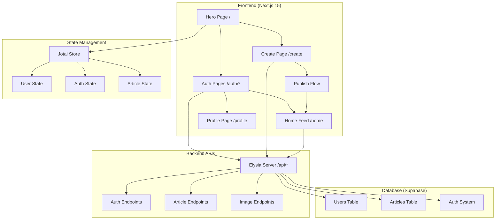

# Design Document

## Overview

The DocSpice Platform Upgrade transforms the existing article creation tool into a comprehensive content platform with user authentication, article publishing, and social discovery features. The design implements a clear separation between content creation (anonymous) and content publishing (authenticated), while maintaining the existing AI-powered article generation capabilities.

## Architecture

### System Architecture



### Database Schema

#### Users Table
```sql
CREATE TABLE users (
    id UUID PRIMARY KEY DEFAULT gen_random_uuid(),
    user_name VARCHAR(50) NOT NULL UNIQUE,
    email VARCHAR(255) NOT NULL UNIQUE,
    password_hash TEXT NOT NULL,
    created_at TIMESTAMP WITH TIME ZONE DEFAULT NOW()
);
```

#### Articles Table
```sql
CREATE TABLE articles (
    id UUID PRIMARY KEY DEFAULT gen_random_uuid(),
    title VARCHAR(255) NOT NULL,
    body TEXT NOT NULL,
    image_links JSONB NOT NULL,
    created_by UUID NOT NULL REFERENCES users(id) ON DELETE CASCADE,
    created_at TIMESTAMP WITH TIME ZONE DEFAULT NOW(),
    updated_at TIMESTAMP WITH TIME ZONE DEFAULT NOW()
);
```

### Technology Stack Integration

- **Frontend**: Next.js 15 with App Router, React Server Components
- **State Management**: Jotai for client-side reactive state
- **Backend**: Elysia framework for high-performance APIs
- **Database**: Supabase with PostgreSQL and built-in auth
- **Styling**: Tailwind CSS with consistent theming
- **Package Manager**: pnpm for dependency management

## Components and Interfaces

- input.tsx (input components)
- button.tsx (button components)
- navBar.tsx (navigation components)
- articleCard.tsx (article components)
- userDashboard.tsx (user components)
- searchInput.tsx ( search on home feed)

### Page Structure Reorganization

#### New Route Structure
```
src/app/
├── page.tsx                    # Hero landing page
├── layout.tsx                 # Root layout with navBar
├── home/
│   └── page.tsx               # Authenticated article feed
├── create/
│   └── page.tsx               # Article creation (moved from root)
├── auth/
│   ├── signin/
│   │   └── page.tsx           # User authentication
│   └── signup/
│       └── page.tsx           # User registration
├── profile/
│   └── page.tsx               # User profile management
└── api/
    └── elysia/                # Elysia backend integration
        ├── auth.ts            # Authentication endpoints
        ├── articles.ts        # Article CRUD operations
        └── images.ts          # Image processing endpoints
        ├── index.ts           # API router
├── Components/                # Core components
├── tests/                    # Unit tests
├── utils/                     # Utility functions
├── atoms/ 
```

### State Management Architecture

#### Jotai Atoms Structure
```typescript
// User authentication state
export const userAtom = atom<User | null>(null)
export const isAuthenticatedAtom = atom(get => get(userAtom) !== null)

// Article state management
export const currentArticleAtom = atom<Article | null>(null)
export const articlesListAtom = atom<Article[]>([])

// UI state
export const isLoadingAtom = atom<boolean>(false)
export const errorMessageAtom = atom<string | null>(null)
```

### Component Hierarchy

#### Core Components
- **HeroSection**: Landing page marketing content with CTA buttons
- **AuthForms**: Reusable signin/signup form components
- **ArticleCard**: Feed display component for article previews
- **ArticleCreator**: Enhanced version of existing creation tool
- **PublishButton**: Authentication-aware publishing component
- **Navigation**: Context-aware navigation based on auth state
- **ProfileDisplay**: User information and article management

### API Interface Design

#### Elysia Backend Endpoints

```typescript
// Authentication endpoints
POST /api/auth/signup
POST /api/auth/signin
POST /api/auth/signout
GET  /api/auth/user

// Article management
POST /api/articles/publish
GET  /api/articles/feed
GET  /api/articles/:id
PUT  /api/articles/:id
DELETE /api/articles/:id

// Image processing
GET  /api/images/search
POST /api/images/process
```

## Data Models

### User Model
```typescript
interface User {
  id: string
  user_name: string
  email: string
  created_at: string
}

interface UserRegistration {
  user_name: string
  email: string
  password: string
}
```

### Article Model
```typescript
interface Article {
  id: string
  title: string
  body: string
  image_links: ImageLink[]
  created_by: string
  created_at: string
  author?: {
    user_name: string
  }
}

interface ImageLink {
  url: string
  alt: string
  position: number
  unsplash_id?: string
}
```

### Article Creation Flow
```typescript
interface ArticleCreationState {
  content: string
  generatedArticle: GeneratedArticle | null
  isPublishing: boolean
  publishError: string | null
}

interface GeneratedArticle {
  title: string
  body: string
  images: ProcessedImage[]
}
```

## User Flow Design

### Authentication Flow
1. **Landing (/)**: Hero section with "Sign In" and "Create Article" options
2. **Anonymous Creation**: Users can access `/create` without authentication
3. **Publish Gate**: Publishing requires authentication, redirects to `/auth/signin`
4. **Post-Auth**: Successful authentication redirects to intended destination
5. **Authenticated Home**: `/home` shows article feed for logged-in users

### Article Lifecycle
1. **Creation**: Anonymous or authenticated users create articles on `/create`
2. **Preview**: Generated article displayed with publish option
3. **Authentication Check**: Publish button triggers auth validation
4. **Publishing**: Authenticated users save articles to database
5. **Feed Display**: Published articles appear in `/home` feed
6. **Individual View**: Articles accessible via `/article/[id]` routes

### Navigation States
- **Anonymous**: Hero → Create → Auth (if publishing)
- **Authenticated**: Home Feed → Create → Profile → Sign Out

## Error Handling

### Authentication Errors
- Invalid credentials: Clear error messages with retry options
- Registration conflicts: Username/email uniqueness validation
- Session expiry: Automatic redirect to signin with return URL
- Network failures: Offline state handling with retry mechanisms

### Article Processing Errors
- Image API failures: Fallback to cached or default images
- Database errors: Graceful degradation with local storage backup
- Validation errors: Real-time form validation with clear feedback
- Publishing failures: Retry mechanisms with error state persistence

### State Management Errors
- Jotai atom initialization failures: Default state fallbacks
- Supabase connection issues: Offline mode with sync on reconnect
- State synchronization conflicts: Last-write-wins with user notification

## Testing Strategy

### Backend API Testing
```typescript
// Test file structure
tests/
├── auth/
│   ├── signup.test.ts         # User registration flows
│   ├── signin.test.ts         # Authentication validation
│   └── session.test.ts        # Session management
├── articles/
│   ├── publish.test.ts        # Article publishing
│   ├── feed.test.ts           # Article retrieval
│   └── crud.test.ts           # Full CRUD operations
├── images/
│   ├── search.test.ts         # Image API integration
│   └── processing.test.ts     # Image optimization
└── integration/
    ├── publish-flow.test.ts   # End-to-end publishing
    └── user-journey.test.ts   # Complete user workflows
```

### Frontend Component Testing
- **Unit Tests**: Individual component behavior and state management
- **Integration Tests**: User flow testing with mocked APIs
- **E2E Tests**: Complete user journeys from landing to publishing
- **State Tests**: Jotai atom behavior and synchronization

### Performance Testing
- **API Load Testing**: Concurrent user simulation for Elysia endpoints
- **Database Performance**: Query optimization for article feeds
- **Image Processing**: Unsplash API rate limiting and caching
- **State Management**: Jotai performance with large article datasets

## Security Considerations

### Authentication Security
- Password hashing using Supabase built-in security
- JWT token management with automatic refresh
- CSRF protection for state-changing operations
- Rate limiting on authentication endpoints

### Data Protection
- Input validation and sanitization for all user content
- SQL injection prevention through parameterized queries
- XSS protection for article content display
- Image URL validation to prevent malicious content

### Authorization
- Route-level protection using Next.js middleware
- API endpoint authorization validation
- User-specific data access controls
- Article ownership verification for modifications

## Performance Optimization

### Frontend Performance
- React Server Components for initial page loads
- Jotai selective subscriptions to minimize re-renders
- Image lazy loading and optimization
- Route-based code splitting

### Backend Performance
- Elysia's high-performance runtime for API endpoints
- Database query optimization with proper indexing
- Caching strategies for frequently accessed articles
- Connection pooling for database operations

### Caching Strategy
- Browser caching for static assets and images
- API response caching for article feeds
- Supabase query caching for user data
- CDN integration for image delivery optimization