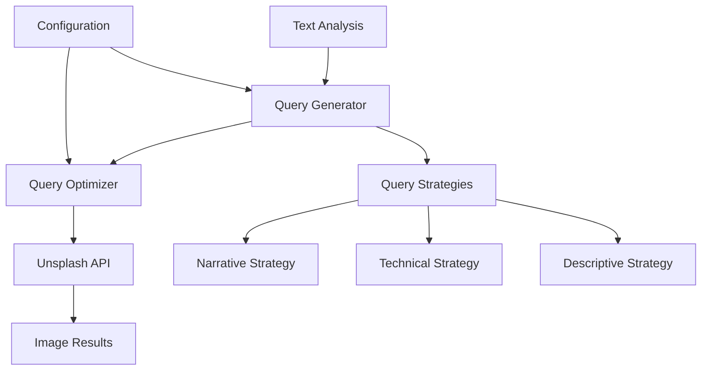

# Design Document: Improved Unsplash Search Query Generation

## Overview

This design enhances the existing Unsplash image search functionality by introducing intelligent query generation, relevance scoring, and context-aware optimization. The solution extends the current `textAnalysis.ts` module with new query generation strategies and adds a query optimization layer that ranks and filters queries before they're sent to the Unsplash API.

The design maintains backward compatibility with the existing `searchImagesForQueries` function while significantly improving the quality and relevance of generated search queries.

## Architecture

### High-Level Flow



### Component Structure

The implementation will add new functions to `src/lib/textAnalysis.ts` and create a new configuration system:

1. **Query Generator** - Generates diverse, contextually relevant queries
2. **Query Optimizer** - Scores, ranks, and filters queries
3. **Content Type Detector** - Identifies content style for strategy selection
4. **Query Strategies** - Different approaches for different content types
5. **Configuration Manager** - Manages tunable parameters

## Components and Interfaces

### 1. Query Configuration Interface

```typescript
interface QueryGenerationConfig {
  // Scoring weights
  weights: {
    keywordImportance: number;      // Default: 0.4
    themeStrength: number;           // Default: 0.3
    querySpecificity: number;        // Default: 0.3
  };
  
  // Thresholds
  thresholds: {
    minRelevanceScore: number;       // Default: 0.3
    maxQueries: number;              // Default: 8
    minQueryWords: number;           // Default: 2
  };
  
  // Term lists
  genericTerms: string[];            // Common words to avoid
  visualDescriptors: string[];       // Colors, moods, settings
  
  // Strategy settings
  contentTypeWeights: {
    narrative: number;               // Default: 0.33
    technical: number;               // Default: 0.33
    descriptive: number;             // Default: 0.34
  };
}
```

### 2. Enhanced Query Data Interface

```typescript
interface SearchQuery {
  query: string;
  relevanceScore: number;
  strategy: 'keyword' | 'theme' | 'entity' | 'combined' | 'contextual';
  components: {
    keywords?: string[];
    themes?: string[];
    entities?: string[];
    descriptors?: string[];
  };
}
```

### 3. Content Type Detection

```typescript
interface ContentTypeAnalysis {
  type: 'narrative' | 'technical' | 'descriptive' | 'mixed';
  confidence: number;
  indicators: {
    narrativeScore: number;
    technicalScore: number;
    descriptiveScore: number;
  };
}
```

## Data Models

### Query Generation Pipeline

The query generation follows this data transformation:

```
TextAnalysis → ContentTypeAnalysis → SearchQuery[] → OptimizedSearchQuery[] → string[]
```

### Relevance Scoring Formula

```
relevanceScore = (
  keywordImportance * weights.keywordImportance +
  themeStrength * weights.themeStrength +
  querySpecificity * weights.querySpecificity
)

where:
- keywordImportance: Average importance score of keywords in query (0-1)
- themeStrength: Number of matching themes / total themes (0-1)
- querySpecificity: (wordCount - 1) / 4, capped at 1.0
```

## Implementation Details

### 1. Content Type Detection

Analyze text characteristics to determine content type:

**Narrative Indicators:**
- High frequency of past tense verbs
- Presence of dialogue markers (quotes)
- Emotional/descriptive adjectives
- Character names (entities)

**Technical Indicators:**
- Present tense, imperative mood
- Technical terminology
- Numbered lists or steps
- Abstract concepts

**Descriptive Indicators:**
- High adjective-to-noun ratio
- Sensory words (visual, tactile)
- Specific measurements or details
- Location/setting descriptions

### 2. Query Strategy Patterns

**Narrative Strategy:**
- Combine emotional descriptors with themes
- Use atmospheric terms (e.g., "dramatic sunset", "peaceful morning")
- Include character-related imagery
- Example: "lonely woman sunset", "emotional journey path"

**Technical Strategy:**
- Use clean, professional modifiers
- Combine concepts with "modern", "minimal", "abstract"
- Focus on clarity and simplicity
- Example: "modern technology workspace", "abstract data visualization"

**Descriptive Strategy:**
- Combine specific objects with settings
- Use concrete visual terms
- Include colors and textures
- Example: "red barn countryside", "wooden table natural light"

### 3. Query Construction Patterns

The generator will create queries using these patterns:

1. **Single Enhanced Keyword**: `[descriptor] + [keyword]`
   - Example: "vibrant forest", "modern office"

2. **Theme + Keyword**: `[theme] + [top keyword]`
   - Example: "nature mountain", "technology innovation"

3. **Entity + Context**: `[entity] + [theme/keyword]`
   - Example: "Paris architecture", "Tesla innovation"

4. **Multi-word Descriptive**: `[descriptor] + [keyword] + [setting]`
   - Example: "peaceful lake sunset", "busy city street"

5. **Contextual Combination**: `[keyword1] + [keyword2] + [descriptor]`
   - Example: "coffee work morning", "mountain hiking adventure"

### 4. Generic Terms Filtering

Default generic terms list (expandable via config):
```typescript
const DEFAULT_GENERIC_TERMS = [
  'thing', 'stuff', 'item', 'object', 'place', 'area', 'way', 'time',
  'person', 'people', 'work', 'life', 'world', 'day', 'year', 'part'
];
```

Queries containing only generic terms will be enhanced or discarded.

### 5. Visual Descriptors

Default visual descriptors to enhance queries:
```typescript
const DEFAULT_VISUAL_DESCRIPTORS = {
  colors: ['vibrant', 'muted', 'warm', 'cool', 'bright', 'dark'],
  moods: ['peaceful', 'dramatic', 'energetic', 'calm', 'mysterious'],
  settings: ['natural', 'urban', 'indoor', 'outdoor', 'minimal'],
  lighting: ['sunset', 'sunrise', 'golden hour', 'soft light', 'dramatic light']
};
```

## Error Handling

### Configuration Errors
- **Invalid config values**: Use defaults and log warning
- **Missing config file**: Use all defaults
- **Type mismatches**: Validate and coerce or use defaults

### Query Generation Errors
- **No valid queries generated**: Fall back to basic keyword queries
- **All queries below threshold**: Lower threshold by 0.1 and retry once
- **Empty text analysis**: Return default fallback queries

### API Integration Errors
- Maintain existing error handling in `searchImagesForQueries`
- Log query performance metrics for optimization
- Track which queries return results vs. empty responses

## Testing Strategy

### Unit Tests

1. **Content Type Detection**
   - Test with narrative text samples
   - Test with technical documentation
   - Test with descriptive passages
   - Verify confidence scores

2. **Query Generation**
   - Test each query strategy pattern
   - Verify query uniqueness
   - Test with edge cases (short text, no keywords)
   - Validate query count limits

3. **Relevance Scoring**
   - Test scoring formula with known inputs
   - Verify score normalization (0-1 range)
   - Test threshold filtering
   - Validate sorting order

4. **Configuration Management**
   - Test default config loading
   - Test custom config override
   - Test invalid config handling
   - Verify runtime updates

### Integration Tests

1. **End-to-End Query Generation**
   - Input: Sample article text
   - Output: Verify query quality and count
   - Check: Queries are diverse and relevant

2. **API Integration**
   - Test with actual Unsplash API
   - Verify improved image relevance
   - Compare results with old vs. new queries

### Performance Tests

1. **Query Generation Speed**
   - Target: < 50ms for typical article
   - Measure with various text lengths

2. **Memory Usage**
   - Ensure no memory leaks with config caching
   - Test with large text inputs

## Migration Strategy

### Backward Compatibility

The new system will be implemented as an enhancement to existing functions:

1. Add new `generateOptimizedImageSearchQueries()` function
2. Keep existing `generateImageSearchQueries()` as fallback
3. Update `src/app/api/generate/route.ts` to use new function
4. Add feature flag for gradual rollout if needed

### Rollout Plan

1. **Phase 1**: Implement core query generation with default config
2. **Phase 2**: Add content type detection and strategies
3. **Phase 3**: Implement relevance scoring and optimization
4. **Phase 4**: Add configuration management
5. **Phase 5**: Integration testing and refinement

## Configuration Example

```typescript
// Default configuration
const DEFAULT_CONFIG: QueryGenerationConfig = {
  weights: {
    keywordImportance: 0.4,
    themeStrength: 0.3,
    querySpecificity: 0.3,
  },
  thresholds: {
    minRelevanceScore: 0.3,
    maxQueries: 8,
    minQueryWords: 2,
  },
  genericTerms: DEFAULT_GENERIC_TERMS,
  visualDescriptors: DEFAULT_VISUAL_DESCRIPTORS,
  contentTypeWeights: {
    narrative: 0.33,
    technical: 0.33,
    descriptive: 0.34,
  },
};
```

## Success Metrics

1. **Query Quality**: Improved image relevance (subjective evaluation)
2. **Query Diversity**: Increased variety in query types
3. **API Efficiency**: Higher success rate (non-empty results) per query
4. **Performance**: Query generation time < 50ms
5. **Maintainability**: Configuration-driven behavior for easy tuning
